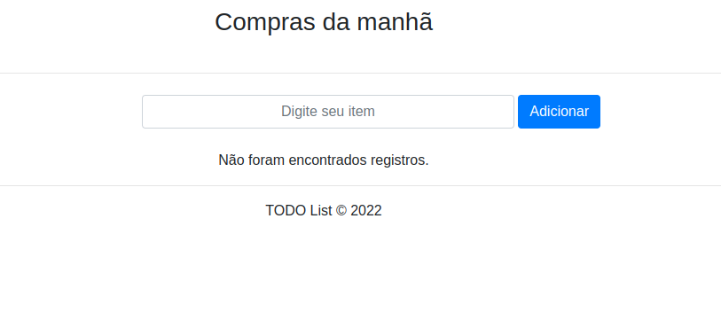
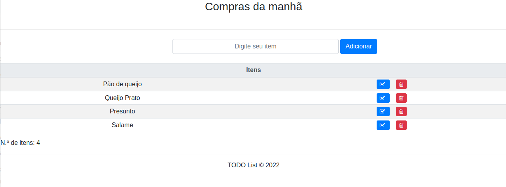
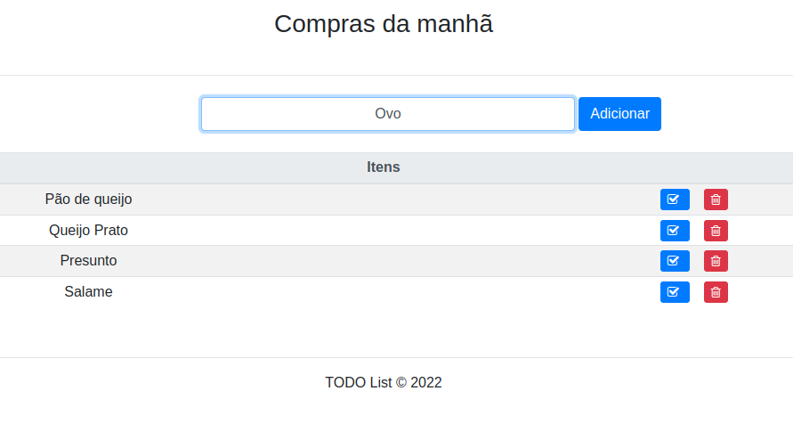
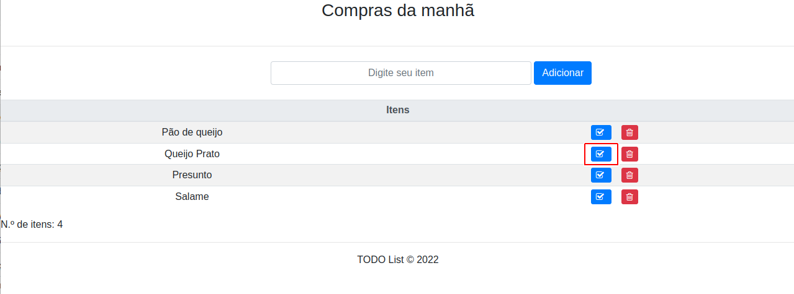

# TODO List feito em CodeIgniter 4

### Banco sem itens cadastrados retorna a mensagem mostrada abaixo:

### Lista com itens retornados do banco de dados.  

## Instalação & atualizações

`composer create-project codeigniter4/appstarter` then `composer update` em qualquer momento
há uma nova versão do framework.

Ao atualizar, verifique as notas da versão para ver se há alguma alteração que você precise aplicar
para sua pasta `app`. Os arquivos afetados podem ser copiados ou mesclados de `vendor/codeigniter4/framework/app`.
## Configuração

Para criação do `banco de dados` utilizar os scripts que estão no arquivo `Seed.sql` que esta localizado na pasta `Seed_Database`.

Modifique o `.env_example` para `.env` e adapte para seu aplicativo, especificamente o baseURL e quaisquer configurações de banco de dados.
## Mudança importante no arquivo index.php

`index.php` não está mais na raiz do projeto! Foi movido para dentro da pasta *public*,
para melhor segurança e separação de componentes.

Isso significa que você deve configurar seu servidor web para "apontar" para a pasta *public* do seu projeto e
não para a raiz do projeto. Uma prática melhor seria configurar um host virtual para apontar para lá. Uma prática ruim seria apontar seu servidor web para a raiz do projeto e esperar inserir *public/...*, pois o resto de sua lógica e o
quadro são expostos.

**Por favor** leia o guia do usuário para uma melhor explicação de como o CI4 funciona!
## Requisitos do servidor

O PHP versão 7.4 ou superior é necessário, com as seguintes extensões instaladas:

- [intl](http://php.net/manual/en/intl.requirements.php)
- [libcurl](http://php.net/manual/en/curl.requirements.php) se você planeja usar a biblioteca HTTP\CURLRequest

Além disso, certifique-se de que as seguintes extensões estejam habilitadas em seu PHP:

- json (habilitado por padrão - não desligue)
- [mbstring](http://php.net/manual/en/mbstring.installation.php)
- [mysqlnd](http://php.net/manual/en/mysqlnd.install.php)
- xml (ativado por padrão - não desligue)
## Instruções de utilização:

No campo escrito `Digite seu item`, inserir o nome do item que deseja e clica no botão `Adicionar` para inseri-lo na sua lista:

#### Completar a tarefa:

Para finalizar uma tarefa e defini-la como finalizada, clicar no `botão azul` com o ícone de `checked`:

#### Deletar uma tarefa:

Para excluir uma tarefa, clicar no `botão vermelho` com o ícone da `lixeira`:

